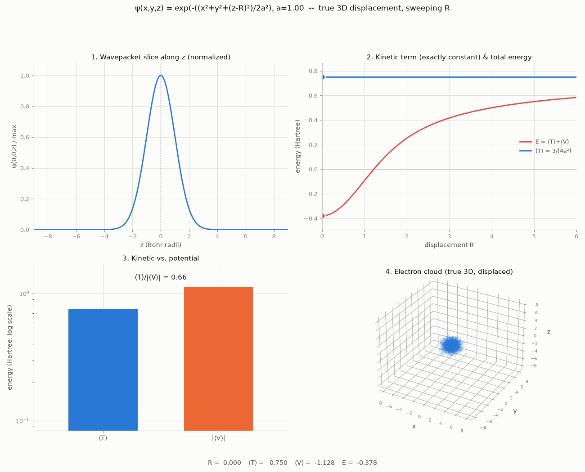
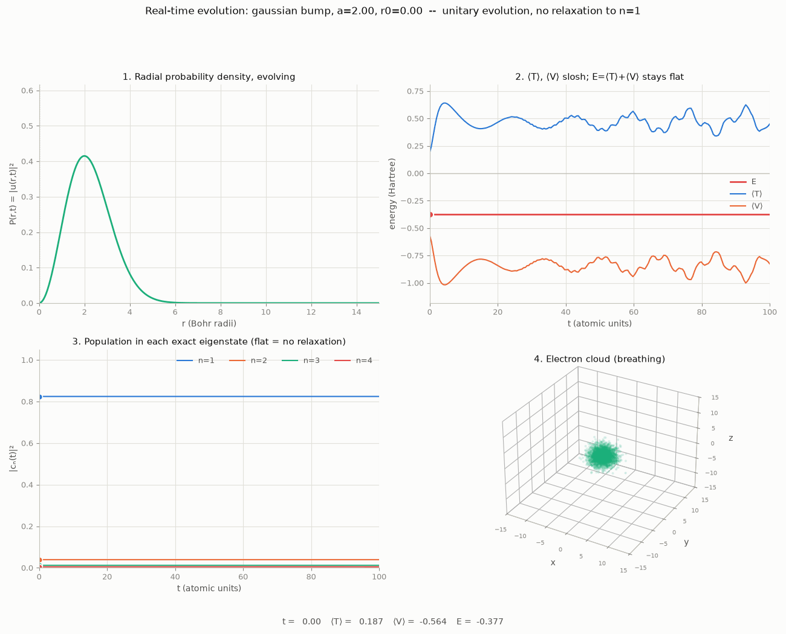
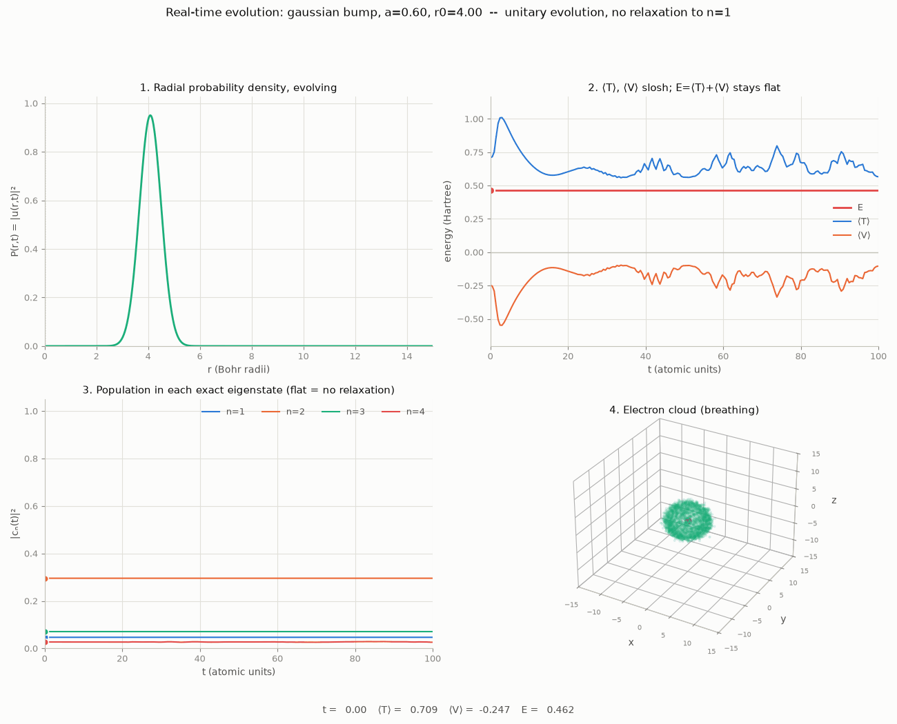
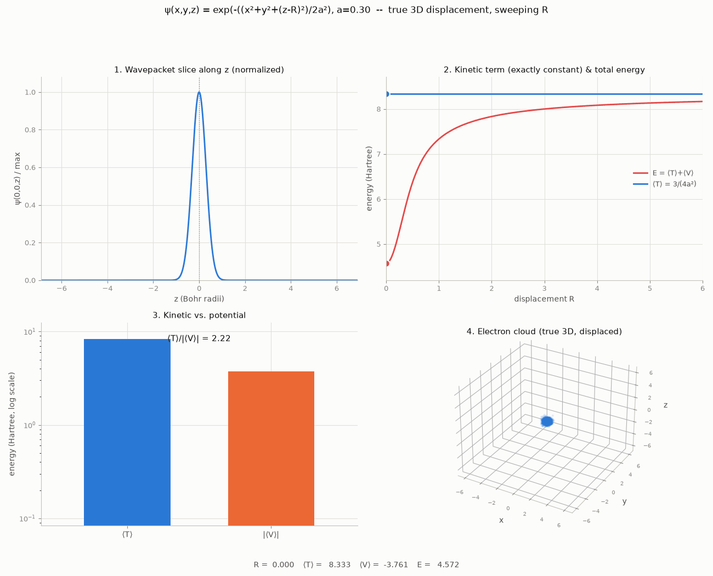
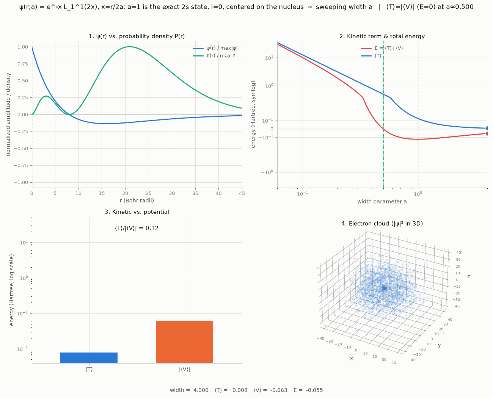
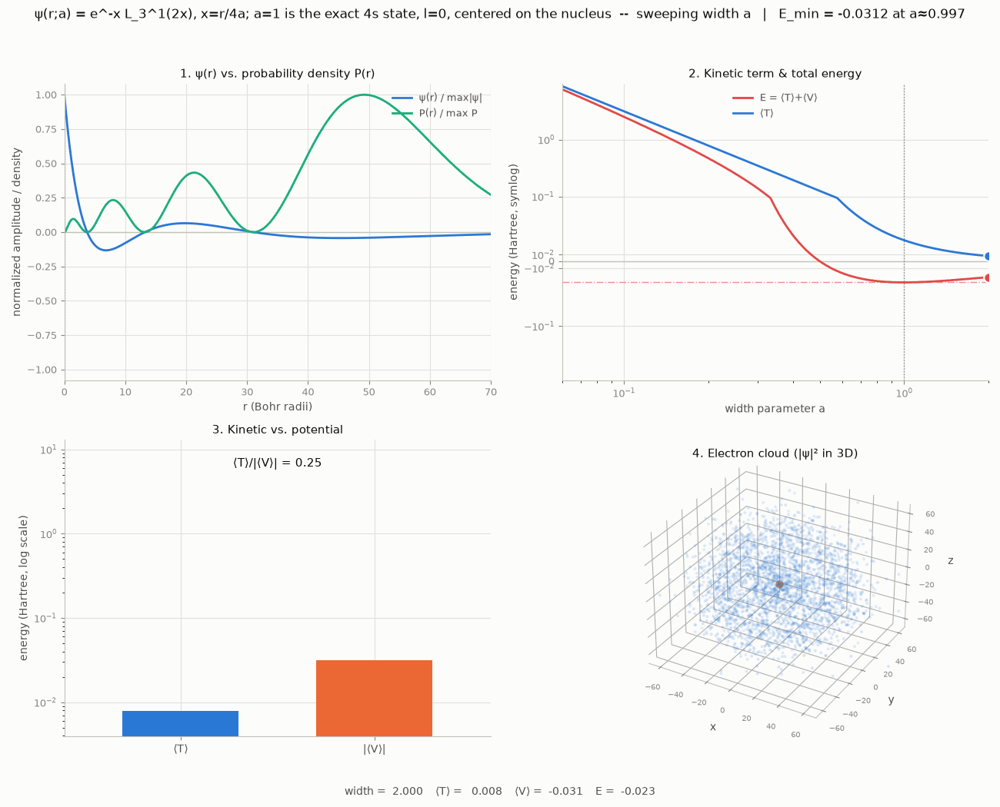
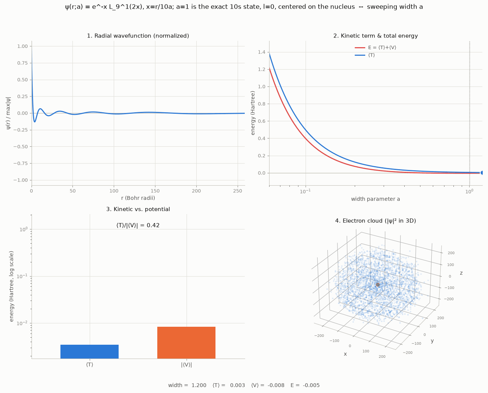
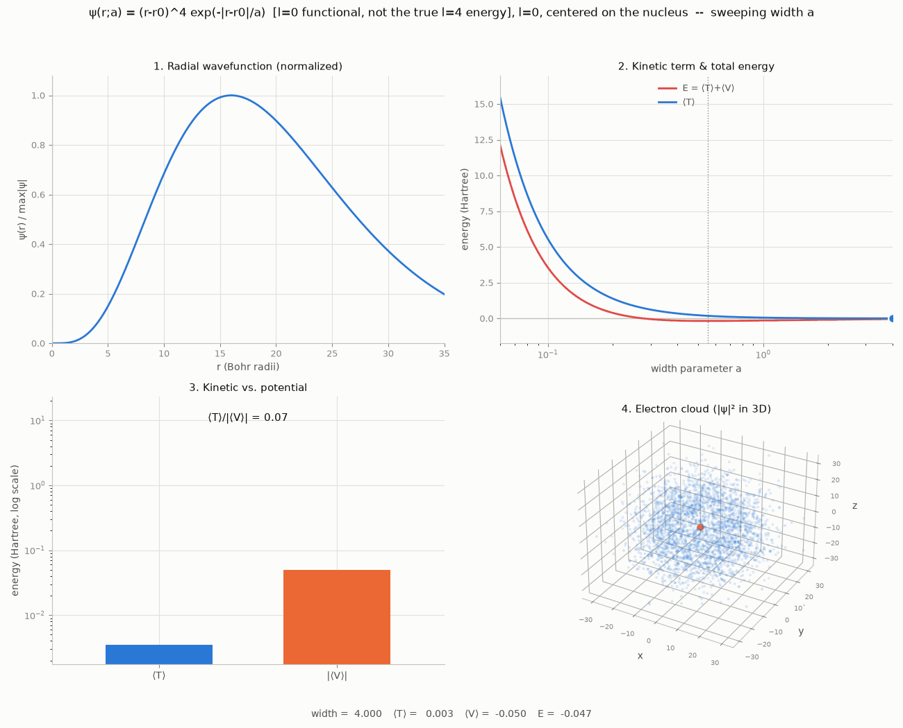

# Schrödinger electron wavefunction: kinetic vs. potential energy

How the two terms of the time-independent Schrödinger equation (atomic
units: $\hbar=m_e=1$, $e^2/4\pi\epsilon_0=1$),

$$H\psi = T\psi + V\psi = -\tfrac12\nabla^2\psi + V(\mathbf r)\psi$$

trade off against each other for hydrogen-atom trial wavefunctions, by
computing $\langle T\rangle$ and $\langle V\rangle$ directly and animating
them across parameter sweeps. Restricted to $l=0$ (spherically symmetric)
states, the 3D integrals reduce to 1D integrals over $r$:

$$1 = 4\pi\int_0^\infty \psi^2 r^2 dr \qquad \langle T\rangle = 2\pi\int_0^\infty \psi'^2 r^2 dr \qquad \langle V\rangle = -4\pi\int_0^\infty \psi^2 r dr$$

(proof in the lab notebook below). The $r^2$/$r$ weight makes $-1/r$
integrable at $r=0$ -- no soft-core regularization needed anywhere in this
project.

That same $r^2$ weight is also why $\psi(r)$ itself and the radial
probability density $P(r)=4\pi r^2\psi(r)^2$ -- the two things people mean
by "where the electron is" -- peak in different places. $\psi(r)$, the
wavefunction amplitude, is largest exactly at the nucleus for every s-state
here; $P(r)$, the probability of actually detecting the electron in a thin
shell at radius $r$, is zero at $r=0$ (nothing has room at exactly zero
radius) and peaks further out. Every wavefunction plot below shows both,
side by side, for exactly this reason.

This README has two parts: this section is self-contained and covers the
two headline results; **[the lab notebook](#lab-notebook)** below has
everything else -- every model tried, every proof, every table.

```
python animate_radial_energy_terms.py width --kind hydrogen1s -o output/radial_width_hydrogen1s.gif
python animate_wavepacket_capture.py --fixed-width 1.0 -o output/wavepacket_capture_a1.0.gif
python animate_radial_time_evolution.py --width 2.0 -o output/radial_time_evolution_wide.gif
```

## Result 1: the width sweep finds the exact hydrogen ground state

Sweeping the width $a$ of a trial wavefunction $\psi(r;a)=e^{-r/a}$ centered
on the nucleus *is* the variational method. The minimum lands at $a_0=1$,
$E_0=-0.5$ Hartree, with $\langle T\rangle/\lvert\langle V\rangle\rvert$
exactly $0.5$ (the virial theorem) -- both match the textbook hydrogen
ground state to 4 decimal places, because this trial family, at that width,
*is* the true solution, not an approximation to it.


*Panel 1: $\psi(r)$ (blue) peaks at the nucleus; $P(r)$ (green) peaks at
$a_0=1$ -- the two notions of "where the electron is." Panel 2: symlog
y-axis so the minimum stays visible next to the $1/a^2$ blow-up; the
dotted vertical line and dash-dot horizontal line cross exactly at the
energy minimum ($E=-0.5$ at $a=1$). Panel 4: a compact ball at small $a$,
spreading out as $a$ grows.*

## Result 2: there is no preferred nonzero electron-nucleus separation

A natural question: does a localized electron prefer to sit some distance
away from the nucleus, rather than right on top of it? Answering this
honestly requires a real 3D displacement (a wavepacket moved to an actual
point in space), not a radial-coordinate trick -- see the lab notebook for
why several radial attempts gave misleading answers. Done properly, an
isotropic Gaussian of width $a$ displaced to $(0,0,R)$ has a closed form:

$$\langle T\rangle(a) = \frac{3}{4a^2} \qquad \langle V\rangle(R,a) = -\frac{\mathrm{erf}(R/a)}{R}$$

$\langle T\rangle$ is *exactly* constant in $R$ (translation invariance of
kinetic energy for a rigid object in free space), which is what makes
energies at different $R$ actually comparable. Checked for $a=1.5$ down to
$0.05$: $E(R)$ increases monotonically from $R=0$ in every case. No
exceptions, no interior minimum.



*$a=1.0$: panel 2's $\langle T\rangle$ line is perfectly flat -- not
approximately, exactly, for every $R$ -- while $E(R)$ climbs the whole way
from $R=0$. Panel 4 stays one solid ball at every frame, simply
translating; it never hollows into a shell the way the radial shell model
did, because nothing here ties the cloud's shape to its distance from the
nucleus.*

**Interpretation:** a single electron falling into a single proton's
Coulomb well has nothing to balance against except its own kinetic energy,
so it simply falls all the way to $R=0$ and settles at whatever width that
kinetic cost allows ($a=1$, from Result 1) -- the ordinary 1s orbital. A
real equilibrium *separation* (a chemical bond, a Van der Waals minimum)
needs a second body or a repulsive term to balance against; a bare electron
and a bare proton have neither. The intuition "the electron doesn't want to
sit exactly on the proton" is correct, but the resolution is the ground
state's *spread* ($a_0=1$), not an *offset* -- two different geometric
ideas.

## Result 3: real time evolution doesn't relax to the ground state

Every sweep above is a sequence of independent *static* variational
calculations. A natural next question: start from a wavepacket that
*isn't* the ground state (too wide, or off-center) and actually evolve it
under the time-dependent Schrödinger equation -- does it relax into the 1s
orbital, the way a classical damped system settles into its minimum?

No. Time evolution under $i\partial_t\psi=H\psi$ is unitary, which forces
two conservation laws: $\langle H\rangle$ is constant, and, expanding the
initial state in the exact eigenbasis $\psi(r,0)=\sum_n c_n\psi_n(r)$, each
term merely picks up a phase, $c_n\to c_n e^{-iE_nt}$ -- so $|c_n|^2$, the
population in eigenstate $n$, is *exactly* constant for all time. There is
no dissipation channel for a closed quantum system to relax through.

```
python animate_radial_time_evolution.py --width 2.0 -o output/radial_time_evolution_wide.gif
python animate_radial_time_evolution.py --width 0.6 --r0 4.0 -o output/radial_time_evolution_offcenter.gif
```



*A Gaussian twice the ground-state width, centered on the nucleus. Panel 1:
$P(r,t)$ visibly breathes. Panel 2: $\langle T\rangle$ and $\langle
V\rangle$ slosh back and forth by a factor of 2, but $E=\langle
T\rangle+\langle V\rangle$ (red) is a perfectly flat line. Panel 3: the
population in each exact eigenstate ($n=1..4$) never moves off its
starting value -- $82\%$ ground state at $t=0$ is still $82\%$ ground state
at $t=100$.*



*A narrow shell started at $r_0=4$. This state's total energy is positive
(mostly continuum/unbound character), so it disperses outward over time
rather than settling anywhere -- but $E$ and every $|c_n|^2$ are exactly as
constant as in the wide case.*

**Numerics:** the standard $l=0$ substitution $u(r,t)=\sqrt{4\pi}\,r\,\psi(r,t)$
turns the 3D equation into a plain 1D Schrödinger equation, $i\partial_t
u=-\tfrac12u''+V(r)u$, with Dirichlet boundaries $u(0)=0$ (forced by the
substitution itself, not imposed) and a hard wall at $r_{\max}$; conveniently,
$|u(r,t)|^2$ *is* $P(r,t)$ with no extra factors. Crank-Nicolson
time-stepping is used because it's an exact unitary (Cayley) transform of a
Hermitian operator at any $\Delta t$ -- norm is conserved to machine
precision every run, and the (tiny, $\sim10^{-4}$ over $t=100$) drift in
$\langle H\rangle$ and $|c_n|^2$ is purely spatial discretization error, not
a physical effect.

**What would actually converge to the ground state:** replacing $t\to
-i\tau$ (imaginary-time propagation, $e^{-H\tau}$ instead of $e^{-iHt}$,
followed by renormalizing at each step) is not physical evolution -- it's a
standard numerical trick in which every excited-state component decays as
$e^{-(E_n-E_0)\tau}$, faster the higher $E_n$ is, so only the ground state
survives. That would reproduce the width sweep's answer by direct
propagation instead of parameter scanning. Not implemented here.

## Requirements

```
pip install -r requirements.txt
```

---

# Lab notebook

Everything tried, in the order it happened, with the reasoning and the
numbers. Proofs and full tables live here; the section above is the
distilled version.

## Proof: where the radial integral forms come from

Start from the full 3D integrals with $d^3r = r^2 dr d\Omega$. For
$\psi(\mathbf r)=\psi(r)$ (no angular dependence, i.e. $l=0$), every
integrand is independent of angle, so $\int d\Omega = 4\pi$ falls out
immediately for the normalization and potential integrals:

$$1=\int|\psi|^2d^3r=\int_0^\infty\psi^2r^2dr\int d\Omega=4\pi\int_0^\infty\psi^2r^2dr$$

$$\langle V\rangle=\int\psi^2V(r) d^3r=4\pi\int_0^\infty\psi^2\left(-\frac1r\right)r^2dr=-4\pi\int_0^\infty\psi^2r dr$$

$\langle T\rangle$ needs the Laplacian of a radial function. For any vector
field $A(r)\hat r$, $\nabla\cdot(A\hat r)=\frac1{r^2}\frac{d}{dr}(r^2A)$
(standard spherical divergence); with $\nabla\psi=\psi'(r)\hat r$, this gives

$$\nabla^2\psi=\frac1{r^2}\frac{d}{dr}\left(r^2\psi'\right)$$

so

$$\langle T\rangle=-\frac12\int\psi\nabla^2\psi d^3r=-2\pi\int_0^\infty\psi (r^2\psi')' dr$$

Integrate by parts: $\int\psi(r^2\psi')'dr=\left[\psi r^2\psi'\right]_0^\infty-\int r^2\psi'^2dr$.
The boundary term vanishes at both ends for any normalizable $\psi$ (checked
numerically to $<10^{-6}$ at $r\to0$ and $<10^{-19}$ at $r\to\infty$ for
both trial shapes used here, including the `hydrogen1s` cusp). So:

$$\langle T\rangle=-2\pi\left(-\int_0^\infty r^2\psi'^2dr\right)=2\pi\int_0^\infty\psi'^2r^2dr$$

No soft-core regularization enters anywhere -- the $r^2$ weight alone
handles the $r=0$ singularity in $V$, and the boundary term in $\langle
T\rangle$'s integration by parts vanishes on its own.

## Width sweep: full results

| trial shape | $a$ | $\langle T\rangle$ | $\langle V\rangle$ | $E$ | $\langle T\rangle/\lvert\langle V\rangle\rvert$ |
|---|---|---|---|---|---|
| `hydrogen1s`, $e^{-r/a}$ | 0.1 | 50.00 | -10.00 | 40.00 | 5.00 |
| `hydrogen1s`, $e^{-r/a}$ | **1.0 (optimal)** | **0.5000** | **-1.0000** | **-0.5000** | **0.5002** |
| `hydrogen1s`, $e^{-r/a}$ | 10 | 0.0050 | -0.1000 | -0.0950 | 0.0500 |
| `gaussian`, $e^{-r^2/2a^2}$ | 0.1 | 75.00 | -11.28 | 63.71 | 6.65 |
| `gaussian`, $e^{-r^2/2a^2}$ | **1.3303 (optimal)** | **0.4238** | **-0.8482** | **-0.4244** | **0.4996** |
| `gaussian`, $e^{-r^2/2a^2}$ | 10 | 0.0075 | -0.1128 | -0.1053 | 0.0665 |


*Same panels, `gaussian` shape. $P(r)$ still peaks away from the origin
even though this isn't the exact eigenstate; the energy-minimum dotted
line sits at $a=1.33$, slightly wider than `hydrogen1s`'s $a=1$, since a
Gaussian needs more spread to make up for being the wrong shape.*

`gaussian`'s virial ratio also lands on $0.5$ (true for *any* shape under
pure dilation -- a scaling argument, not specific to the right shape), but
its energy floor ($-0.4244$) sits measurably above the true $-0.5$: a
Gaussian is the wrong shape, and $\langle H\rangle\geq E_{\text{ground}}$
makes that gap visible directly.

## What does $\langle T\rangle=\lvert\langle V\rangle\rvert$ mean?

Every width-sweep figure's panel 2 highlights only the energy minimum now
(the plots used to also mark where $\langle T\rangle=\lvert\langle
V\rangle\rvert$; that's been dropped in favor of the minimum, which is
the more relevant landmark -- see below). Since
$E=\langle T\rangle+\langle V\rangle=\langle T\rangle-\lvert\langle
V\rangle\rvert$, $\langle T\rangle=\lvert\langle V\rangle\rvert$ is just a
restatement of $E=0$ -- an identity, true for *any* shape or potential,
not a new calculation. For `hydrogen1s` it falls at exactly $a=0.5$ (half
the ground-state width); for `gaussian`, $a\approx0.665$.

**Why isn't it on the plot?** The energy minimum *is* the answer to the
physics question this whole project asks -- it's the actual ground state
(or, for the `ns` shapes, the actual excited state) when the trial family
is right. $E=0$ is a much narrower fact: it's the width below which *this
one-parameter family, with no freedom to change shape*, stops being
competitive with a free (unbound) particle. Below $a=0.5$, `hydrogen1s`
at that width has higher energy than an electron infinitely far away at
rest -- confinement has gotten expensive enough to outweigh the binding.
It's a real, easy-to-read threshold, but it answers "how far can I
over-confine this shape before it's not worth it," not "what does the
atom actually look like" -- that's the minimum's job, so the minimum is
what stays on the plot.

## Shell sweep: a real effect, initially explained wrong

Translating a spherically symmetric function isn't possible without
breaking the symmetry, so "how far is a localized electron from the
nucleus" becomes (while staying $l=0$): the radius $r_0$ of a fixed-thickness
shell.

| shell thickness $a$ | $r_0^\ast$ | $E^\ast$ | $E(r_0=0)$ | bound? |
|---|---|---|---|---|
| 1.0 | 0.05 | -0.379 | -0.378 | yes, negligibly off-center |
| 0.7 | 0.43 | -0.182 | -0.081 | yes |
| 0.5 | 0.56 | +0.237 | +0.743 | no |
| 0.2 | 0.54 | +5.32 | +13.11 | no |
| 0.1 | 0.51 | +24.01 | +63.71 | no |
| 0.05 | 0.50 | +98.88 | +277.32 | no |


*$a=0.2$: panel 1 shows $\psi(r)$ and $P(r)$ coinciding in shape here
(both just the shell profile -- $l=0$ still, so $P(r)$ is the same $r^2$
reweighting as everywhere else in this project, it just looks less
dramatic on an already-hollow shell). Panel 4 is the clearest view: a
solid ball at $r_0=0$ opening into a hollow shell as $r_0$ grows.*


*$a=0.05$: same mechanism, more extreme -- note the panel 2 symlog axis
now spans nearly 3 decades, and the minimum (still a real dip, around
$r_0\approx0.5$) would be invisible on a linear scale sized to fit
$E(r_0=0)\approx277$.*

**First explanation (wrong):** I initially described this as the shell
getting "clipped" by the $r\geq0$ boundary. That's wrong -- $r$ is a radial
distance, never negative to begin with, so nothing is discarded.

**Correct mechanism:** at $r_0=0$ the trial function is a compact isotropic
3D ball, $\langle T\rangle=3/(4a^2)$ (confined in 3 directions). For
$r_0\gg a$ it's a thin shell, confined only radially since $l=0$ carries no
angular kinetic energy: $\langle T\rangle\to1/(4a^2)$, exactly $3\times$
lower (checked to 4+ significant figures against both closed forms).
Moving the shell out trades that kinetic relief against slowly-fading
$\langle V\rangle\sim1/r_0$, producing the interior minimum. Real, correctly
computed, geometric -- not an artifact.

**But it doesn't change the interpretive conclusion:** every row above is
worse than the true ground state ($E=-0.5$), and thin shells aren't even
bound. A fixed-thickness shell is a restricted family; restricting the
search can only underperform the true optimum. Free both $a$ and $r_0$
together (the width sweep) and the optimum collapses to $r_0=0,a=1$.

### Other radial shapes tried

- $\psi(r)=r e^{-(r-r_0)^2/2a^2}$: analytic node at the nucleus, no
 boundary behavior. Still an interior minimum, converging to
 $r_0^\ast\approx1.0$ (not $\approx0.5$) as $a\to0$ -- same ball-vs-shell
 transition, different balance point.
- User-proposed $\psi(r)=(r/a) e^{-(r-a)^2}$: the $1/a$ factor is a global
 constant, and renormalization divides any such constant back out exactly
 (checked to 6 decimals with/without it) -- it does nothing. What *does*
 help is the shape's fixed, unscaled Gaussian width: $\langle T\rangle$
 only ranges $\approx0.55$ to $\approx1.10$ across $a=3\to0.1$, since the
 object's physical size never shrinks. Still the same underlying
 transition, though, just damped.

Conclusion: no purely radial ($l=0$) family can describe an electron
actually displaced to one side -- a function of $r$ alone is identical in
every direction by construction. Hence Result 2's genuinely 3D model.

## Displaced wavepacket: derivation and full check

$\langle T\rangle=3/(4a^2)$ is the standard 3D isotropic-Gaussian kinetic
energy (three independent $1/(4a^2)$ contributions, one per axis) and is
translation-invariant on general grounds. $\langle V\rangle(R,a)$ is the
electrostatic energy between a point charge and a Gaussian charge cloud of
width $a$ a distance $R$ away -- a standard closed form (the same integral
that appears in Ewald summation):
$\langle V\rangle=-\mathrm{erf}(R/a)/R\to-2/(a\sqrt\pi)$ as $R\to0$.
Verified against the $r_0=0$ shell-sweep value at $a=1$ ($-1.1284$, matching
$2/\sqrt\pi$) as a cross-check.

| $a$ | $\langle T\rangle$ | $E(R=0)$ | $R^\ast$ |
|---|---|---|---|
| 1.5 | 0.333 | -0.419 | 0 |
| 1.0 | 0.750 | -0.378 | 0 |
| 0.7 | 1.531 | -0.081 | 0 |
| 0.5 | 3.000 | +0.743 | 0 |
| 0.3 | 8.333 | +4.572 | 0 |
| 0.2 | 18.75 | +13.11 | 0 |
| 0.1 | 75.00 | +63.72 | 0 |
| 0.05 | 300.0 | +277.4 | 0 |



*$a=0.3$: a much more localized packet, same result -- $\langle T\rangle$
flat, $E(R)$ monotonic from $R=0$. This isn't a radial plot, so there's no
$P(r)$ panel here; panel 1 is a literal 1D slice through the packet along
its axis of motion, free to be centered at any real $z$ (no $r\geq0$
restriction, since $z$ is an ordinary Cartesian coordinate, not a radius).*

$R^\ast=0$ in every row -- this is Result 2, and this table is the
evidence for it.

## The ns states, n=1..4, 10

The 1s width sweep is a variational search over a one-lobe family; the same
idea generalizes to every s-state at once. The exact hydrogen ns ($l=0$)
shape, rescaled as a whole by $a$ ($a=1$ reproduces the literal state),
uses the associated Laguerre polynomial $L_{n-1}^1$:

$$\psi(r;a)=e^{-x}L_{n-1}^1(2x), \quad x=\frac{r}{na}$$

```
python animate_radial_energy_terms.py width --kind hydrogen2s  -o output/radial_width_hydrogen2s.gif
python animate_radial_energy_terms.py width --kind hydrogen4s  -o output/radial_width_hydrogen4s.gif
python animate_radial_energy_terms.py width --kind hydrogen10s -o output/radial_width_hydrogen10s.gif
```

| $n$ | $a^\ast$ | $E^\ast$ | exact $-1/(2n^2)$ | ratio | nodes |
|---|---|---|---|---|---|
| 1 | 1.000 | -0.5000 | -0.5000 | 0.5000 | 0 |
| 2 | 1.000 | -0.1250 | -0.1250 | 0.5000 | 1 |
| 3 | 0.997 | -0.0556 | -0.0556 | 0.5000 | 2 |
| 4 | 0.998 | -0.0312 | -0.0312 | 0.5000 | 3 |
| 10 | 1.002 | -0.0050 | -0.0050 | 0.5000 | 9 |



*$n=2$: panel 1 shows $\psi(r)$ crossing zero once (its single node) while
$P(r)$, always $\geq0$, shows two humps separated by the node instead --
another case where the two curves genuinely look different, not just
rescaled copies of each other.*



*$n=4$: 3 nodes in $\psi(r)$, 4 humps in $P(r)$. Note panel 1's much wider
x-axis ($r$ up to 70) -- higher-$n$ states are physically larger.*



*$n=10$: 9 nodes, extent out past $r=250$. Same exact-energy, exact-virial-
ratio result as every other row in the table -- the pattern doesn't break.*

Every row: minimum at $a=1$, exact energy, exact virial ratio, correct node
count ($n-1$). This only works because $a$ rescales the *entire* shape
(nodes included) together, keeping it exactly that eigenfunction's form at
every point in the sweep. An unconstrained joint search over decay length
and node positions independently does *not* find these points -- it runs
away toward the node(s) pushed to infinity, degenerating back to the 1s
shape ($E\to-0.5$). Expected: excited states are stationary points of
$\langle H\rangle$, not minima, unless the search is constrained to stay
orthogonal to every lower state (here, implicitly, by keeping the shape
exactly right).

One practical trap hit building this: higher-$n$ states are physically
larger (extent grows roughly with $n$: $r_{\max}\approx400$ was needed for
$n=10$, vs. $25$ for $n=1$), so they need a larger grid than 1s does.
Reusing the 1s grid for `hydrogen4s` silently truncated the tail,
corrupting the normalization -- energy off by ~10% and the virial ratio
wrong (0.62 instead of 0.5). Rather than hand-tune a grid size for every
future $n$, `width_grid_for_kind` in `animate_radial_energy_terms.py` now
estimates $r_{\max}$ directly (a quick coarse scan for the radius holding
99.9% of the density) for any `hydrogenNs`, falling back to hand-tuned
values only for the shapes already checked against exact energies above.

**A different way to avoid $r=0$: `quartic`, $\psi(r;a)=r^4e^{-r/a}$.**
Every ns state above still has $\psi(0)\neq0$ (true even with $n-1$ nodes
further out); this shape is forced to vanish at the origin to 4th order
instead, to test directly whether that matters:

```
python animate_radial_energy_terms.py width --kind quartic -o output/radial_width_quartic.gif
```



*Panel 1 makes the shape obvious: $\psi(r)$ (and hence $P(r)$) rises from
zero at the origin, peaks around $r=4a$, then decays -- no amplitude left
near the nucleus at all, unlike every `hydrogenNs` shape above.*

Minimum at $a^\ast=0.554$, $E^\ast=-0.180$ Hartree, virial ratio $0.500$
(that part always holds under pure dilation). Compare to `hydrogen1s`'s
exact $-0.5$: **both are nodeless, single-lobe shapes**, differing only in
whether they're forced away from $r=0$ -- and forcing it away costs $0.32$
Hartree, a large fraction of the whole binding energy. That's a direct,
quantitative version of the "why $\psi$ peaks at $r=0$" answer below: for
$l=0$, avoiding the origin is expensive, so the true ground state doesn't.

One caveat worth being explicit about: $r^4e^{-r/a}$ happens to be the
exact *shape* of hydrogen's nodeless $l=4$ state (5g), but the energy above
is **not** the true 5g energy ($-1/50$) -- this project's $\langle
T\rangle$ formula has no centrifugal term ($l(l+1)/2r^2$), because it was
derived for $l=0$ only (see the proof). Plugging an $l=4$-shaped function
into the $l=0$ functional answers "what does avoiding $r=0$ cost an s-state
candidate," which is what was asked; it is not a real g-orbital
calculation.

## Why does $\psi$ peak at $r=0$ at all?

Two things resolve the "electron wants to hang out at the nucleus"
discomfort:

1. $\psi(r)$ peaking at $r=0$ is not the same claim as "the electron is
 usually found at $r=0$." The actual detection probability is
 $P(r)=4\pi r^2\psi(r)^2$, which is *zero* at $r=0$ (the $r^2$ factor)
 and peaks at $a_0$ -- $\psi$ and $P$ are different objects and peak in
 different places.
2. For $l=0$ there is no centrifugal term ($l(l+1)/2r^2$) in the radial
 equation, so nothing prevents amplitude from concentrating at the
 origin the way it does for $l\geq1$ states (which are exactly zero at
 $r=0$, a real, forced effect of angular momentum). With that obstruction
 absent and $V(r)$ deepest at $r=0$, the lowest-energy (nodeless)
 solution puts its amplitude there, balanced against the kinetic cost of
 concentration -- exactly the trade-off the width sweep traces out.

## What this project does and doesn't simulate

Every *sweep* (Results 1 and 2, and everything in the lab notebook above
this section) is a sequence of independent, static variational calculations
-- each frame recomputes $\langle T\rangle,\langle V\rangle$ for one trial
wavefunction; nothing evolves in time. "The electron falls in and speeds
up" is a useful classical intuition for those, but it isn't what the sweeps
show.

**Real quantum dynamics** (Result 3, `animate_radial_time_evolution.py`)
*is* now built: a wavepacket time-evolved under the full time-dependent
Schrödinger equation, restricted to $l=0$. The headline finding there is
almost the opposite of the classical intuition: a closed quantum system
under unitary evolution doesn't relax to the ground state at all -- energy
and every eigenstate population are exactly conserved (see Result 3). At
high principal quantum number $n$ (not attempted here -- this project's
`hydrogenNs` states only go up to whatever grid size is practical, and the
interesting wavepackets there are localized superpositions across a wide
$n$ range), such wavepackets are known to trace out near-classical orbits
for a while (the correspondence principle) before dephasing, since
hydrogen's level spacing isn't uniform.

**Purely classical** (Newton's law for a point charge in a $-1/r$
potential) is a different model, not a limit of this one, and still isn't
built here.
