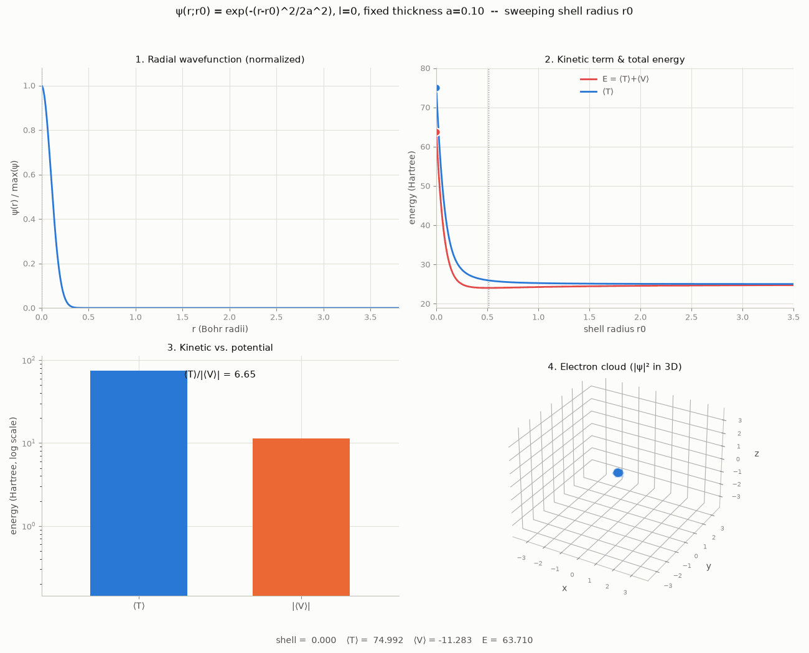

# Schrödinger electron wavefunction: kinetic vs. potential energy

Visualizes how the two terms of the time-independent Schrödinger equation, in
atomic units ($\hbar = m_e = 1$, $e^2/4\pi\epsilon_0 = 1$),

$$H\psi = T\psi + V\psi = -\tfrac{1}{2}\nabla^2\psi + V(\mathbf{r})\,\psi$$

trade off against each other for hydrogen-atom trial wavefunctions, by
computing $\langle T\rangle$ and $\langle V\rangle$ directly and animating
them as a width or position parameter sweeps.

Two models are implemented, in order of preference:

## 1. The genuine 3D model (recommended), `animate_radial_energy_terms.py`

Restricting to $l=0$ (spherically symmetric, no $\theta,\phi$ dependence)
trial wavefunctions $\psi(r)$ turns the full 3D integrals into 1D integrals
over $r$ with the spherical measure $4\pi r^2\,dr$:

$$
1 = 4\pi\!\int_0^\infty \psi(r)^2\,r^2\,dr,
\qquad
\langle T\rangle = 2\pi\!\int_0^\infty \psi'(r)^2\,r^2\,dr,
\qquad
\langle V\rangle = -4\pi\!\int_0^\infty \psi(r)^2\,r\,dr
$$

(the last since $V(r) = -1/r$). The $r^2$/$r$ weight makes $-1/r$ integrable
at $r=0$ on its own -- no soft-core trick needed, unlike the 1D model below
-- and the width sweep reproduces the exact hydrogen ground state
($a_0=1$, $E_0=-0.5$ Hartree, virial ratio exactly $\langle T\rangle /
|\langle V\rangle| = 0.5$, to numerical precision) instead of an
approximation of it. This is just the real Schrödinger equation, restricted
to $l=0$ trial shapes -- not a toy.

```
python animate_radial_energy_terms.py width --kind hydrogen1s -o output/radial_width_hydrogen1s.gif
python animate_radial_energy_terms.py width --kind gaussian    -o output/radial_width_gaussian.gif
python animate_radial_energy_terms.py shell  --kind gaussian    -o output/radial_shell_gaussian.gif
```

**Four panels per frame, with every axis scale fixed for the whole
animation** -- only the curves/points move, never the frame itself:

1. The radial wavefunction, normalized to $\psi/\max(\psi)$ each frame --
   its raw amplitude varies by orders of magnitude across the sweep and
   isn't the interesting part, so normalizing keeps the y-axis fixed at
   $[0,1]$ and lets the x-extent alone show the change in spread.
2. $\langle T\rangle$ and total energy $E = \langle T\rangle + \langle
   V\rangle$ traced across the whole sweep, with a marker for the current
   frame (log-x in `width` mode, so the $1/a^2$ blow-up at small $a$ and the
   flat large-$a$ tail are both visible in one view).
3. A bar chart of $\langle T\rangle$ vs. $|\langle V\rangle|$, log-scale
   y-axis (fixed for the whole run) since the two span orders of magnitude
   in `width` mode -- a fixed *linear* scale would make most frames
   unreadable, and rescaling it per frame would defeat the point of fixed
   axes.
4. A 3D "electron cloud" -- points sampled from $|\psi(r)|^2$ in 3D (uniform
   on the sphere at each sampled radius, exact for $l=0$), drawn with low
   alpha so density reads visually. Its cube is fixed for the whole run too.

### `width` mode

The radial bump stays centered on the nucleus ($r_0=0$) while its width $a$
is swept from very large down to very small (well past the energy-minimizing
width) and back, to show the $\sim 1/a^2$ kinetic-energy cost of confinement.

### `shell` mode

Replaces the flat 1D model's `position` sweep. You can't translate a
spherically symmetric function off-center without breaking the symmetry, so
the 3D equivalent of "how far from the nucleus is a localized electron" is
the radius $r_0$ of a spherical shell of fixed thickness $a$, not a
Cartesian shift.

This *can* produce a genuine energy minimum away from the nucleus -- but
it's worth being precise about why, since it's a different effect from the
one people usually mean by "the electron doesn't want to sit on the
nucleus." The real hydrogen 1s wavefunction $\psi(r) = e^{-r/a}$ is actually
*largest* at $r=0$; what peaks at the Bohr radius instead is the radial
probability density $4\pi r^2\psi(r)^2$, purely from the $r^2$ volume factor
(shells at larger $r$ have more room), with no change of shape in $\psi$
itself required.

The `shell` sweep's off-center minimum is a *different* mechanism: a
Gaussian shell of thickness $a$ centered at $r_0=0$ gets clipped in half by
the $r \geq 0$ boundary (the other half would live at $r<0$, which doesn't
exist), and renormalizing that clipped half makes it taller and steeper --
i.e. costs kinetic energy. As $r_0$ grows past roughly $1.5a$ the shell
clears the boundary and that penalty vanishes, while $\langle V\rangle$ only
weakens slowly ($\sim 1/r_0$). The competition between a fast-vanishing
kinetic penalty and a slow-fading potential benefit is what produces an
interior minimum, and it only shows up for $a$ thin enough that the clipping
is significant -- the default `--fixed-width 0.2` shows it dramatically (a
deep, purely repulsive kinetic penalty near $r_0=0$, unbound throughout,
$E>0$ everywhere); try `--fixed-width 0.7` to see it while staying bound
($E<0$ at the minimum), or `--fixed-width 1.0` to see it disappear (the
shell is fat enough that clipping barely matters, same qualitative shape as
the flat 1D `position` sweep).

## 2. The 1D line model (earlier version, kept for contrast), `animate_energy_terms.py`

A simpler starting point: a wavefunction $\psi(x)$ on a 1D line through the
nucleus, with

$$\langle T\rangle = \tfrac12\!\int |\psi'(x)|^2\,dx, \qquad \langle
V\rangle = \int |\psi(x)|^2\,V(x)\,dx$$

against a soft-core 1D Coulomb potential $V(x) = -1/\sqrt{x^2+\epsilon^2}$
(a nucleus at the origin; $\epsilon$ regularizes the $1/x$ divergence -- see
"Why soft-core?" below). Two trial wavefunction shapes are supported
(`schrodinger_terms.py`): `hydrogen1s`: $e^{-|x-x_0|/a}$, and `gaussian`:
$e^{-(x-x_0)^2/2a^2}$.

**`width`** -- the wavefunction stays centered on the nucleus ($x_0=0$)
while its width $a$ is swept from very large (spread out) down to very
small (localized) and back. Models "how spread out is the electron."

```
python animate_energy_terms.py width --kind hydrogen1s -o output/width_hydrogen1s.gif
python animate_energy_terms.py width --kind gaussian    -o output/width_gaussian.gif
```

**`position`** -- the width $a$ is held fixed at a somewhat localized value
(default 1.0) while the wavefunction's center $x_0$ is swept away from and
back across the nucleus. Models "how far from the nucleus is the (equally
localized) electron." (Named $x_0$, not $r_0$ -- too easily misread as a
Bohr radius -- and not $a$, already the width.)

```
python animate_energy_terms.py position --kind gaussian -o output/position_gaussian.gif
```

Each run renders three panels per frame: the wavefunction, total energy
$E(a)$ or $E(x_0)$ traced across the whole sweep with a marker for the
current frame, and a bar chart comparing $\langle T\rangle$ against
$|\langle V\rangle|$ with their ratio annotated.

### Why soft-core?

In 3D, the hydrogen 1s trial family $\psi(r;a) = e^{-r/a}$ needs no
regularization: the volume element $r^2\,dr$ makes $1/r$ integrable at the
origin, and $\langle T\rangle(a) = 1/2a^2$, $\langle V\rangle(a) = -1/a$
follow from clean scaling. Minimizing $E(a) = \langle T\rangle + \langle
V\rangle$ gives $a_0=1$ (the Bohr radius) and $E_0=-0.5$ Hartree -- the
exact hydrogen ground state -- with the virial theorem $2\langle T\rangle =
|\langle V\rangle|$ holding exactly at that minimum, for *any* trial shape
related by pure dilation, not just this one.

In 1D the same integral ($dx$, not $r^2\,dr$) diverges at $x=0$ for any
wavefunction with $\psi(0)\neq0$, so $-1/|x|$ has to be softened to stay
finite on a grid. That regularization breaks the exact $1/a$ scaling of
$\langle V\rangle(a)$, so the width-sweep's energy minimum lands close to,
but not exactly at, $\langle T\rangle/|\langle V\rangle| = 0.5$ here -- the
deviation shrinks as $\epsilon/a$ shrinks. This is a genuine artifact of
collapsing a radial problem onto a line, not a bug in the integration -- and
exactly what the genuine 3D model above avoids.

## Results and analysis

All numbers below are from the genuine 3D ($l=0$) radial model.

### Width sweep: recovers the exact hydrogen ground state

| trial shape | $a_0$ (optimal width) | $E_0$ (Hartree) | $\langle T\rangle/|\langle V\rangle|$ at $a_0$ |
|---|---|---|---|
| `hydrogen1s`, $e^{-r/a}$ | 1.0000 | -0.5000 | 0.5002 |
| `gaussian`, $e^{-r^2/2a^2}$ | 1.3303 | -0.4244 | 0.4996 |


*`hydrogen1s`, width swept a=4→0.06→4. The minimum sits at $a_0=1$ (the
Bohr radius) with $E_0=-0.5$ Hartree and $\langle T\rangle/|\langle
V\rangle|=0.5002$ -- the virial theorem, exact to 4 decimal places, because
this trial shape at this width **is** the true hydrogen ground state, not
an approximation to it. At the narrow end ($a=0.06$) $\langle T\rangle
\approx 139$ Hartree, ~8x $|\langle V\rangle|$: confinement cost, not
binding. At the wide end ($a=4$) $\langle T\rangle \approx 0.03$, and $E$
has climbed back to within $0.28$ Hartree of the unbound $E=0$ line.*


*`gaussian` version of the same sweep. The virial ratio still lands almost
exactly on $0.5$ at its own minimum ($0.4996$) -- that part of the theorem
holds for *any* shape under pure dilation, not just the correct one. But
$E_0=-0.4244$ Hartree is measurably above the true $-0.5$: a Gaussian is a
worse-shaped trial function than the exponential cusp, and the variational
principle ($\langle H\rangle \geq E_\text{ground}$ for every normalized
trial $\psi$) makes that gap visible directly as a higher minimum energy.*

**Interpretation:** the width sweep *is* the classical variational
calculation for the hydrogen atom. $\langle T\rangle \sim 1/a^2$ grows
faster than $\langle V\rangle \sim -1/a$ shrinks as $a\to0$, so confinement
always costs more kinetic energy than it gains in potential energy below
some width -- the $E>0$ region on the left of panel 2 is the uncertainty
principle made visible. The competition produces a minimum, and *only* at
that minimum does $2\langle T\rangle=|\langle V\rangle|$ hold. This
directly answers the question of whether solving the Schrödinger equation
is "finding the lowest-energy wavefunction": yes, by the Rayleigh-Ritz
variational principle, and the `hydrogen1s` curve reaching the exact,
independently-known hydrogen ground state ($-0.5$ Hartree, $a_0=1$) is the
proof -- a wide enough trial family finds the true answer, not just a bound
on it.

### Shell sweep: what the off-nucleus minimum does and doesn't mean

| shell thickness $a$ | $r_0^*$ (optimal radius) | $E^*$ | $E(r_0=0)$ | bound? |
|---|---|---|---|---|
| 1.0 | 0.05 | -0.379 | -0.378 | yes -- minimum is negligibly off-center |
| 0.7 | 0.43 | -0.182 | -0.081 | yes -- clear minimum, still bound |
| 0.5 | 0.56 | +0.237 | +0.743 | no -- minimum exists, but unbound |
| 0.2 | 0.54 | +5.32 | +13.11 | no -- dramatic, deeply unbound |
| 0.1 | 0.51 | +24.01 | +63.71 | no -- extreme; $r_0=0$ is catastrophic |


*Shell thickness $a=0.2$, radius swept $r_0=0\to3.5\to0$. Energy dips to a
minimum at $r_0^*\approx0.54$ ($E^*\approx+5.3$ Hartree) and rises sharply
toward $r_0=0$ ($E\approx+13.1$) -- panel 4 visibly shows a compact ball at
$r_0=0$ opening into a hollow shell as $r_0$ grows past $a$.*



*Shell thickness $a=0.1$ (`--fixed-width 0.1`), same sweep. The mechanism
is more extreme: $E(r_0=0)\approx+64$ Hartree vs. $E^*\approx+24$ at
$r_0^*\approx0.51$ -- more than a 2.5x energy penalty just for centering
this particular (too-thin) shell on the nucleus, all from the boundary
clipping described below. $r_0^*$ itself barely moves between $a=0.2$ and
$a=0.1$ (0.54 → 0.51): once $a$ is small enough for the clipping penalty to
dominate, the optimal radius saturates at roughly $r_0^*\approx 2$–$3a$
rather than continuing to track $a$.*

**What the minimum means.** For a rigid Gaussian shell of fixed thickness
$a$ centered at $r_0=0$, half its mass would sit at $r<0$, which doesn't
exist -- the $r\geq0$ boundary clips it, and renormalizing the clipped half
makes it taller and steeper, which is a real kinetic-energy cost (compare
$\langle T\rangle(r_0{=}0)=18.75$ vs. the flat-space value $\langle
T\rangle\approx6.3$ once $r_0$ clears the boundary, at $a=0.2$). Moving the
shell out relieves that penalty quickly, while $\langle V\rangle$ only
fades slowly ($\sim1/r_0$) -- so for $a$ thin enough, there's a radius
where the trade-off is optimal. That's a genuine, correctly-computed
result, not a numerical artifact.

But it is a *different* result from "the electron prefers the Bohr
radius." Compare the shell family's best achievable energy to the true
ground state from the width sweep, $E=-0.5$: **every row in the table above
is worse** -- even the best case ($a=1$, $E^*=-0.379$) falls short, and
thin shells ($a\leq0.5$) aren't even bound. This is the variational
principle again, from the other side: a shell of fixed, non-optimal
thickness is a *restricted* trial family, and restricting the search can
only ever match or underperform the true unrestricted minimum -- never
beat it. If both $a$ and $r_0$ are set free simultaneously (i.e. the width
sweep), the optimum collapses back onto $r_0=0$, $a=1$: the ordinary,
nucleus-centered 1s orbital. The shell sweep's off-center minimum is real,
but it's a statement about the cost of rigidity (forcing a bad width to
stay put), not about where a free electron "wants" to be. That's a genuinely
different mechanism from the textbook radial probability density
$4\pi r^2\psi(r)^2$ peaking at the Bohr radius (see `shell` mode above),
which requires no rigidity assumption at all -- it's a property of the true,
unconstrained ground state itself.

## Requirements

```
pip install -r requirements.txt
```
