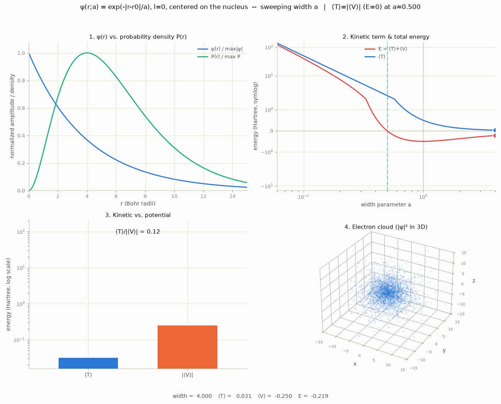
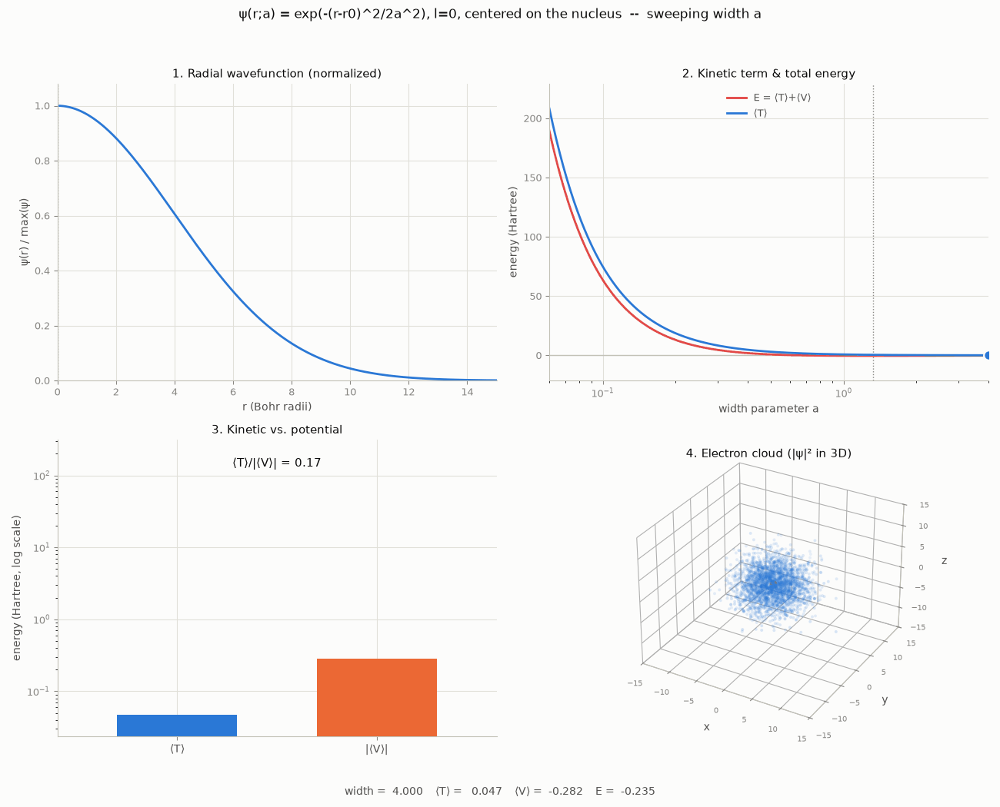
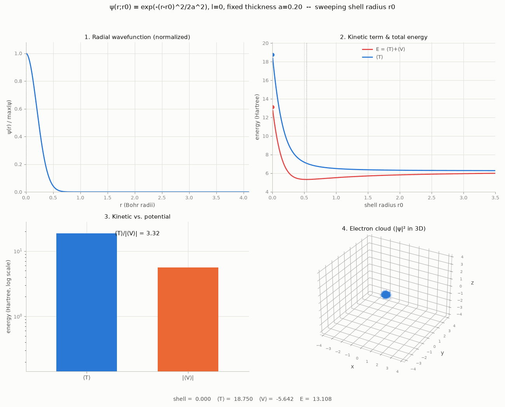
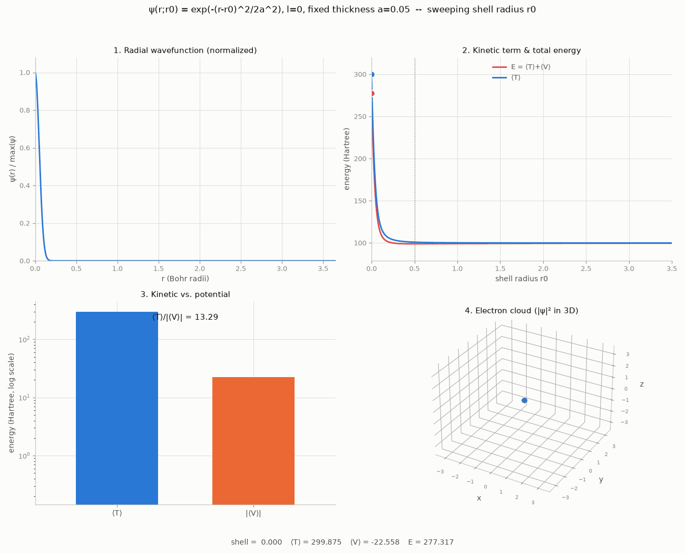

# Schrödinger electron wavefunction: kinetic vs. potential energy

Visualizes how the two terms of the time-independent Schrödinger equation, in
atomic units ($\hbar = m_e = 1$, $e^2/4\pi\epsilon_0 = 1$),

$$H\psi = T\psi + V\psi = -\tfrac{1}{2}\nabla^2\psi + V(\mathbf{r})\psi$$

trade off against each other for hydrogen-atom trial wavefunctions, by
computing $\langle T\rangle$ and $\langle V\rangle$ directly and animating
them as a width or shell-radius parameter sweeps.

Restricting to $l=0$ (spherically symmetric, no $\theta,\phi$ dependence)
trial wavefunctions $\psi(r)$ turns the full 3D integrals into 1D integrals
over $r$ with the spherical measure $4\pi r^2 dr$:

$$
1 = 4\pi\int_0^\infty \psi(r)^2 r^2 dr
\qquad
\langle T\rangle = 2\pi\int_0^\infty \psi'(r)^2 r^2 dr
\qquad
\langle V\rangle = -4\pi\int_0^\infty \psi(r)^2 r dr
$$

(the last since $V(r) = -1/r$). The $r^2$ / $r$ weight makes $-1/r$
integrable at $r=0$ on its own -- no soft-core regularization needed, and
the width sweep reproduces the exact hydrogen ground state ($a_0=1$,
$E_0=-0.5$ Hartree, virial ratio exactly $\langle T\rangle /
\lvert\langle V\rangle\rvert = 0.5$, to numerical precision). This is just
the real Schrödinger equation, restricted to $l=0$ trial shapes -- not a
toy.

```
python animate_radial_energy_terms.py width --kind hydrogen1s -o output/radial_width_hydrogen1s.gif
python animate_radial_energy_terms.py width --kind gaussian    -o output/radial_width_gaussian.gif
python animate_radial_energy_terms.py shell  --kind gaussian    -o output/radial_shell_gaussian.gif
```

**Four panels per frame, with every axis scale fixed for the whole
animation** -- only the curves/points move, never the frame itself:

1. The radial wavefunction, normalized to $\psi/\max(\psi)$ each frame --
   its raw amplitude varies by orders of magnitude across the sweep and
   isn't the interesting part, so normalizing keeps the y-axis fixed at
   $[0,1]$ and lets the x-extent alone show the change in spread.
2. $\langle T\rangle$ and total energy $E = \langle T\rangle + \langle
   V\rangle$ traced across the whole sweep, with a marker for the current
   frame (log-x in `width` mode, so the $1/a^2$ blow-up at small $a$ and the
   flat large-$a$ tail are both visible in one view).
3. A bar chart of $\langle T\rangle$ vs. $\lvert\langle V\rangle\rvert$,
   log-scale y-axis (fixed for the whole run) since the two span orders of
   magnitude in `width` mode -- a fixed *linear* scale would make most
   frames unreadable, and rescaling it per frame would defeat the point of
   fixed axes.
4. A 3D "electron cloud" -- points sampled from $\lvert\psi(r)\rvert^2$ in
   3D (uniform on the sphere at each sampled radius, exact for $l=0$),
   drawn with low alpha so density reads visually. Its cube is fixed for
   the whole run too.

## `width` mode

The radial bump stays centered on the nucleus ($r_0=0$) while its width $a$
is swept from very large down to very small (well past the energy-minimizing
width) and back, to show the $\sim 1/a^2$ kinetic-energy cost of confinement.

## `shell` mode

You can't translate a spherically symmetric function off-center without
breaking the symmetry, so "how far is a localized electron from the
nucleus," restricted to the $l=0$ family, becomes: the radius $r_0$ of a
spherical shell of fixed thickness $a$, swept outward from the nucleus.

This *can* produce a genuine energy minimum away from the nucleus. It's
worth being precise about the mechanism, and about what it does and
doesn't demonstrate physically -- see **Results and analysis** below for
the full writeup; the short version is that it's a real geometric effect
(a compact ball vs. a thin shell have different kinetic energy for the
same thickness $a$), not a numerical artifact, but it's also *not* the
same thing as "the electron prefers the Bohr radius" -- see below.

## Results and analysis

### Width sweep: recovers the exact hydrogen ground state

| trial shape | $a$ | $\langle T\rangle$ | $\langle V\rangle$ | $E$ | $\langle T\rangle/\lvert\langle V\rangle\rvert$ |
|---|---|---|---|---|---|
| `hydrogen1s`, $e^{-r/a}$ | 0.1 ($=0.1 a_0$) | 50.00 | -10.00 | 40.00 | 5.00 |
| `hydrogen1s`, $e^{-r/a}$ | **1.0 ($=a_0$, optimal)** | **0.5000** | **-1.0000** | **-0.5000** | **0.5002** |
| `hydrogen1s`, $e^{-r/a}$ | 10 ($=10 a_0$) | 0.0050 | -0.1096 | -0.1046 | 0.0456 |
| `gaussian`, $e^{-r^2/2a^2}$ | 0.1 | 75.00 | -11.28 | 63.71 | 6.65 |
| `gaussian`, $e^{-r^2/2a^2}$ | **1.3303 (optimal)** | **0.4238** | **-0.8482** | **-0.4244** | **0.4996** |
| `gaussian`, $e^{-r^2/2a^2}$ | 10 | 0.0073 | -0.1133 | -0.1060 | 0.0647 |



*`hydrogen1s`, width swept $a{=}4\to0.06\to4$. The minimum sits at
$a_0=1$ (the Bohr radius) with $E_0=-0.5$ Hartree and $\langle
T\rangle/\lvert\langle V\rangle\rvert=0.5002$ -- the virial theorem, exact
to 4 decimal places, because this trial shape at this width **is** the
true hydrogen ground state, not an approximation to it. At $a=0.1 a_0$,
$\langle T\rangle=50$ Hartree, 5x $\lvert\langle V\rangle\rvert$:
confinement cost, not binding. At $a=10 a_0$, $\langle T\rangle$ has
collapsed to $0.005$, and $E$ has climbed back to within $0.10$ Hartree of
the unbound $E=0$ line.*



*`gaussian` version of the same sweep. The virial ratio still lands almost
exactly on $0.5$ at its own minimum ($0.4996$) -- that part of the theorem
holds for *any* shape under pure dilation, not just the correct one. But
$E_0=-0.4244$ Hartree is measurably above the true $-0.5$: a Gaussian is a
worse-shaped trial function than the exponential cusp, and the variational
principle ($\langle H\rangle \geq E_{\text{ground}}$ for every normalized
trial $\psi$) makes that gap visible directly as a higher minimum energy.*

**Interpretation:** the width sweep *is* the classical variational
calculation for the hydrogen atom. $\langle T\rangle \sim 1/a^2$ grows
faster than $\langle V\rangle \sim -1/a$ shrinks as $a\to0$, so confinement
always costs more kinetic energy than it gains in potential energy below
some width -- the $E>0$ region on the left of panel 2 is the uncertainty
principle made visible. The competition produces a minimum, and *only* at
that minimum does $2\langle T\rangle=\lvert\langle V\rangle\rvert$ hold.
This directly answers whether solving the Schrödinger equation is "finding
the lowest-energy wavefunction": yes, by the Rayleigh-Ritz variational
principle, and `hydrogen1s` reaching the exact, independently-known
hydrogen ground state is the proof -- a wide enough trial family finds the
true answer, not just a bound on it.

### Shell sweep: a ball-vs-shell effect, not a boundary artifact

| shell thickness $a$ | $r_0^\ast$ | $E^\ast$ | $E(r_0=0)$ | bound? |
|---|---|---|---|---|
| 1.0 | 0.05 | -0.379 | -0.378 | yes -- minimum is negligibly off-center |
| 0.7 | 0.43 | -0.182 | -0.081 | yes -- clear minimum, still bound |
| 0.5 | 0.56 | +0.237 | +0.743 | no -- minimum exists, but unbound |
| 0.2 | 0.54 | +5.32 | +13.11 | no -- dramatic, deeply unbound |
| 0.1 | 0.51 | +24.01 | +63.71 | no -- extreme |
| 0.05 | 0.50 | +98.88 | +277.32 | no -- very extreme |



*Shell thickness $a=0.2$: energy dips to a minimum at $r_0^\ast\approx0.54$
and rises sharply toward $r_0=0$ -- panel 4 visibly shows a compact ball at
$r_0=0$ opening into a hollow shell as $r_0$ grows past $a$.*



*Shell thickness $a=0.05$: $E(r_0=0)\approx278$ Hartree vs.
$E^\ast\approx99$ at $r_0^\ast\approx0.50$ -- nearly a 3x penalty for
centering this shell on the nucleus. Note $r_0^\ast$ has barely moved from
the $a=0.2$ case (0.54 → 0.50): once $a$ is small, the optimal radius
saturates around $r_0^\ast \approx 0.5$ almost independent of $a$, rather
than continuing to shrink with it.*

**What's actually happening (a correction from an earlier version of this
README).** I originally described this as the shell getting "clipped" by
the $r\geq0$ boundary. That was wrong, and worth spelling out why: $r$ is a
*radial distance*, not a position on a line -- it was never negative to
begin with, so there's no missing "other half" being discarded anywhere.
Nothing is truncated.

What's actually happening is a clean, exactly-computable geometric effect.
At $r_0=0$ the trial function collapses to an isotropic 3D ball centered on
the nucleus, and its kinetic energy is $\langle T\rangle = 3/(4a^2)$ --
confinement in all three spatial directions. As $r_0$ grows past a few
multiples of $a$, the same fixed-$a$ function becomes a thin spherical
shell, confined *only* along the radial direction (it's free to spread
across the entire angular extent of the sphere at radius $r_0$ at zero
kinetic cost, since $l=0$ means zero angular momentum by construction), and
$\langle T\rangle \to 1/(4a^2)$ -- exactly a factor of 3 lower. (Both limits
check out to 4+ significant figures numerically against these closed
forms.) Moving the shell outward relieves that kinetic penalty quickly
while $\langle V\rangle$ only fades slowly ($\sim 1/r_0$), and the
competition between the two produces the interior minimum. It's a real,
correctly-computed effect -- just a different one than I originally said.

That correction doesn't change the main interpretive conclusion, though.
Compare the shell family's best achievable energy at each thickness to the
true ground state from the width sweep, $E=-0.5$: **every row in the table
above is worse**, and thin shells ($a\leq0.5$) aren't even bound. A shell of
fixed, non-optimal thickness is a *restricted* trial family, and
restricting the search can only ever match or underperform the true
unrestricted minimum. Free both $a$ and $r_0$ at once (i.e. the width
sweep) and the optimum collapses back onto $r_0=0$, $a=1$ -- the ordinary,
nucleus-centered 1s orbital. The shell sweep's off-center minimum is real,
but it's a statement about the geometry of confining a rigid, badly-sized
shape, not about where a free electron "wants" to be -- which is also why
it's a different mechanism from the textbook radial probability density
$4\pi r^2\psi(r)^2$ peaking at the Bohr radius (see `shell` mode above):
that peak requires no rigidity assumption at all, since it's a property of
the true, unconstrained ground state itself.

### An alternative shell shape, and why the deeper question needs full 3D

A natural next question: is the ball-vs-shell effect an artifact of the
particular *shape* used (a plain Gaussian, which is not required to vanish
at $r=0$)? I tested $\psi(r) = r e^{-(r-r_0)^2/2a^2}$ -- a shape with an
analytic node at the nucleus for any $r_0$, no boundary behavior involved
at all. It still shows an interior energy minimum, but a different one:
$r_0^\ast$ converges toward $\approx 1.0$ (not $\approx 0.5$) as $a\to0$.
That's expected, now that the real mechanism is understood -- this shape is
still a compact, radially-confined blob near $r_0=0$ and a thin shell for
$r_0\gg a$, so the same ball-vs-shell transition still happens; only the
detailed shape (and hence the exact balance point) changes.

That result points at the real limitation, though: *any* purely radial
($l=0$) family -- shell, node-shell, or otherwise -- can only describe a
spherically symmetric charge distribution centered on the nucleus. It
cannot describe "an electron sitting off to one side," because a function
of $r=\lvert\mathbf r\rvert$ alone is, by construction, the same in every
direction. A genuinely displaced electron needs a real 3D calculation in
$(x,y,z)$, which is a natural next step for this project if the goal is
modeling capture rather than further tinkering with radial shapes.

## Requirements

```
pip install -r requirements.txt
```
